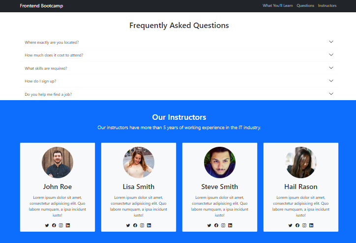

# Bootcamp Website Page - A bootcamp website landing page 

## Welcome! 👋

Thanks for checking out this page.

## Techstack Used

**HTML, CSS, BOOTSTRAP**

## Challenge Description

The challenge is to build out this landing page and get it look user friendly at possible screen sizes. It is a completely responsive website page.

Users are able to: 

- View the optimal layout for the site depending on their device's screen size
- See active states for all interactive elements on the page
- View modal form on button click
## Output Images 

👉 Desktop Design

<table>
<tr>

<td></td>
<td></td>

</tr>

<tr>

<td></td>
<td></td>
</tr>

</table>

👉 Mobile Design

<table>
<tr>
<td>
</td>
<td>
</td>

</tr>
<tr>
<td>
</td>
<td>
</td>

</tr>

</table>

## Project Reference
This project is taken from You tube.  [Click here](https://www.youtube.com/watch?v=4sosXZsdy-s&t=853s) 

